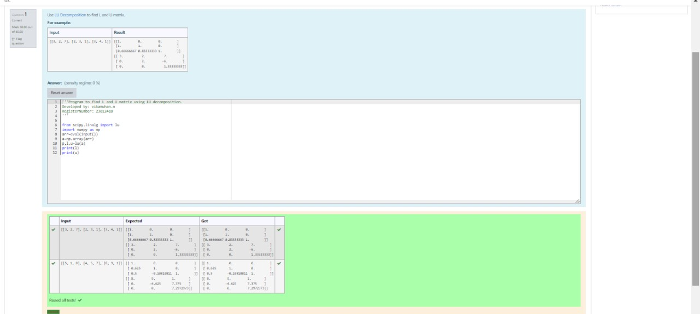
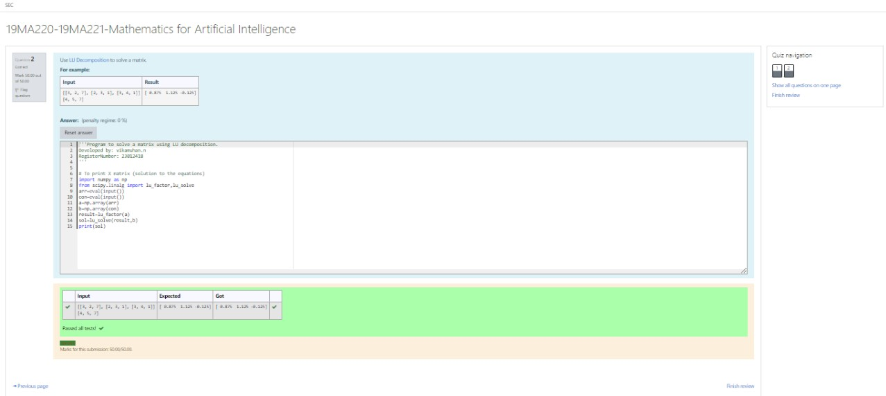

# LU Decomposition 

## AIM:
To write a program to find the LU Decomposition of a matrix.

## Equipments Required:
1. Hardware – PCs
2. Anaconda – Python 3.7 Installation / Moodle-Code Runner

## Algorithm
(i) To find the L and U matrix

1.First we import numpy as np and import lu from linalg in scipy module
2.Then we initialize a list in the name of arr and ask input from the user
3.We initialize P,L,U as lu of A
4.We print the output of L and U

(ii) To find the LU Decomposition of a matrix

1.We import lu_factor and lu_solve from linalg module in scipy module
2.Then we initialize a list in the name of arr and ask input from the user
3.Then we initialize a list in the name of constant and ask input from the user
4.We initialize result as factorization of A and initialze solution with value of lu_solve method on (result,B)
5.Now we print the solution

## Program:
(i) To find the L and U matrix
```py
#Program to find L and U matrix using LU decomposition.
#Developed by: Vikamuhan.n
#RegisterNumber: 23012418

from scipy.linalg import lu
import numpy as np
arr=eval(input())
A=np.array(arr)
P,L,U=lu(A)
print(L)
print(U)
```
(ii) To find the LU Decomposition of a matrix
```py
#Program to solve a matrix using LU decomposition.
#Developed by:  Vikamuhan.n
#RegisterNumber: 23012418


# To print X matrix (solution to the equations)
from scipy.linalg import lu_factor,lu_solve
import numpy as np
arr=eval(input())
constant=eval(input())
A=np.array(arr)
B=np.array(constant)
result=lu_factor(A)
solution=lu_solve(result,B)
print(solution)
```

## Output:



## Result:
Thus the program to find the LU Decomposition of a matrix is written and verified using python programming.

